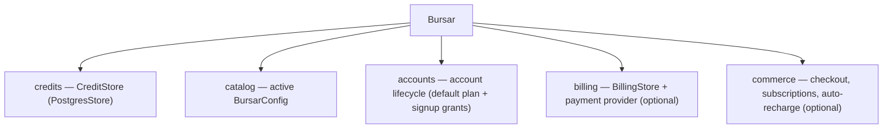

# Architecture

`Bursar` is the application boundary. Integrations construct one facade and
use its capabilities; they never wire credit and billing services together
independently.

## Facade

`billing` and `commerce` are present only when you supply a `billing_store`
(and, for `commerce`, `commerce_options`) at construction. With commerce
enabled, the facade registers an auto-recharge hook that runs after every
deduction.

## Capabilities

- **credits** — balances, the append-only ledger, lots, leases, allowances,
  quotas, and analytics.
- **catalog** — publishes, activates, and pins versioned configurations;
  billing never owns configuration writes.
- **accounts** — assigns the default plan and executes `account_created`
  grant programs on signup.
- **billing** — provider-agnostic lifecycle: subscription events, invoices,
  and subscription changes.
- **commerce** — checkout intents, offers (subscriptions and topups), and
  auto-recharge guardrails.

See [Credit accounting](./data-model.mdx) for the accounting entities, and
[Configuration and catalog revisions](./configuration.mdx) for the document that drives
them.

## Database model

PostgreSQL stores one balance per row in `credit_accounts`. Every purchase,
grant, deduction, refund, expiry, lease settlement, and team charge passes
through one locked ledger-posting function and appends to
`credit_ledger_entries`.

`credit_lots` and `credit_lot_allocations` derive bucket availability and
expiry. `credit_leases` hold temporary reservations with their policy
snapshot. Plan membership is non-monetary state in `account_plan_assignments`;
usage windows and allowance consumption are keyed by account.

All rows carry a mandatory `tenant_id`; tenant-prefixed unique constraints and
composite foreign keys keep tenants isolated even under buggy code. See
[Multi-tenancy](../guides/multitenancy.mdx) for provisioning and
[Storage backends](../guides/storage-backends.mdx) for the store interface.

## Migration ownership

The Bursar command-line interface applies ordered, append-only SQL migrations from the SDK package. Recorded checksums protect applied migrations, and `bursar migrate` fails when an installed migration no longer matches its recorded checksum.

Stores and facades never create database objects. Use the [CLI reference](../cli.mdx) for migration commands and the [database schema](./database-schema.md) for generated table relationships.

## Concurrency and safety

The hot path is one atomic store transaction: allowance consumption,
entitlement, quota enforcement, and the debit commit or roll back together.
Lease admission (`reserve`) enforces policy in the same transaction as the
hold, so availability checks and the actual bill cannot disagree. Every
mutation is idempotency-keyed per account, and the ledger is append-only, so
retries and webhook redeliveries replay instead of double-posting.

## Optional storage

`PostgresStore` is the only credit store; `PostgresBillingStore` persists
billing state. Both are constructed tenant-bound and run over the same
migrated schema — see [Storage backends](../guides/storage-backends.mdx).

## Related

- [Credit accounting](./data-model.mdx): accounts, the ledger, lots, and leases on one schema
- [Configuration and catalog revisions](./configuration.mdx): the document the catalog publishes and activates
- [Provision and isolate tenants](../guides/multitenancy.mdx): tenant context and isolation
- [Configure storage backends](../guides/storage-backends.mdx): the store interface and the PostgreSQL implementation
