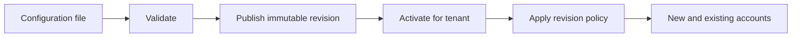

# Configuration and catalog revisions

`BursarConfig` brings the pricing, credit, access, and commerce models together in one strict versioned document. Python and TypeScript validate the same schema, so one active catalog revision produces the same policy decisions in both SDKs.

## One document owns product policy

Each top-level section owns one part of the product model:

| Section        | Responsibility                                                        |
| -------------- | --------------------------------------------------------------------- |
| `pricing`      | Metered operations, measures, dimensions, and reusable rate cards     |
| `credits`      | Credit buckets, spending policies, grants, and display conversion     |
| `entitlements` | Typed product features                                                |
| `admission`    | Reusable concurrency policies                                         |
| `plans`        | Product access, allowances, quotas, and policy references             |
| `commerce`     | Payment providers, offers, plan changes, and auto-recharge guardrails |
| `catalog`      | Catalog-wide settings, including the default signup plan              |

Keeping these domains in one document lets validation reject broken cross-references before publication. A plan cannot name an unknown rate card, an offer cannot name an unknown plan, and a price rule cannot use a measure or dimension that its operation does not declare.

## Validation is shared across SDKs

Pydantic defines the Python contract and generates the published JSON Schema. TypeScript validates the same contract with Ajv. Unknown fields and legacy shapes are rejected instead of being ignored.

The validation boundary also enforces these accounting rules:

- Exact decimal values use strings instead of binary floating-point numbers
- Every integer stays within JavaScript's exact safe-integer range
- Offer prices use integer minor units with an explicit currency
- Matcher operators agree with their declared dimension types
- Expressions reference only measures declared by their operation
- Credit buckets and allowance priorities share one collision-free ordering namespace
- Subscription-backed plans declare when catalog revisions take effect

The smallest valid document declares its schema version and credit boundary:

```yaml
version: 1
credits:
  buckets:
    purchased: { priority: 10 }
  default_bucket: purchased
```

Run validation before publication:

```bash title="Terminal"
bursar config validate bursar.yaml
```

Use `--json` for structured diagnostics in continuous integration (CI) and editor integrations. Use the [published JSON Schema](https://zonastery.github.io/bursar/pricing-config.schema.json) for editor completion and the [validated complete example](https://github.com/zonastery/bursar/blob/main/skills/bursar/assets/pricing.config.example.yaml) as the canonical full configuration sample.

## Catalog revisions are immutable

Publishing validates the document and stores an immutable catalog revision. Activation selects the revision used for new pricing and policy decisions within one tenant.



Each revision has a SHA-256 digest of its canonical document. Publishing the same digest reuses the existing revision, while activation records history and leaves prior revisions available for audit and rollback.

The catalog exposes three lifecycle operations:

| Operation            | Effect                                                                  |
| -------------------- | ----------------------------------------------------------------------- |
| Publish a draft      | Validate and store a revision without changing the active catalog       |
| Activate a revision  | Select one active revision for the tenant and schedule applicable moves |
| Publish and activate | Validate, store, and activate one document in a single workflow         |

Use the [CLI reference](../cli.mdx) for exact `config validate`, `set`, `get`, `list`, `activate`, `diff`, and `schema` commands. Use the generated SDK reference for programmatic catalog signatures.

## Revision policy controls rollout

Plans define when an activated revision reaches assigned accounts. `immediate` applies the new revision at activation, `next_renewal` waits for the next subscription renewal, and `new_assignments_only` leaves existing assignments on their current revision until an explicit migration.

Subscription-backed plans default to `next_renewal`; other plans default to `immediate`. Declare the policy explicitly when a rollout delay changes customer-visible pricing or access.

## Public projections exclude private configuration

The active configuration remains the internal policy document. Catalog projection methods expose only the product fields needed by a client application and keep provider identifiers, internal policies, and private configuration out of public responses.

## Related

- [Pricing model](./pricing.mdx): operations, rate cards, and charge types
- [Plans and access control](./plans.mdx): allowances, entitlements, quotas, and revision policy
- [Billing and commerce](./billing.mdx): providers, offers, subscriptions, and auto-recharge
- [Create your first metered charge](../quickstart.mdx): validate and publish a minimal configuration
