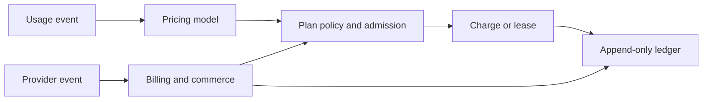

import DocCardList from "@theme/DocCardList";

# Understand the Bursar system

These pages explain the boundaries and domain model behind Bursar. Read them in order when you are evaluating the system or designing an integration; use the how-to guides when you need implementation steps.

## Read the concepts in order

1. [Architecture](./architecture.mdx) defines the application boundary, capabilities, transaction model, and extension points.
2. [Credit accounting](./data-model.mdx) explains accounts, lots, leases, allowances, and the append-only ledger.
3. [Pricing model](./pricing.mdx) shows how operations, measures, rate cards, and rules produce an exact charge.
4. [Plans and access](./plans.mdx) explains entitlements, quotas, allowances, credit policies, and admission controls.
5. [Billing and commerce](./billing.mdx) connects provider events to offers, subscriptions, plan assignments, and credit grants.
6. [Configuration and catalog revisions](./configuration.mdx) brings those domains together in one validated, versioned document.

## Browse concepts

<DocCardList />

## Continue with an implementation task

Open the [how-to guides](../guides/index.mdx) to provision tenants, protect monetary operations, manage credits, connect subscriptions, or integrate agent tooling.
