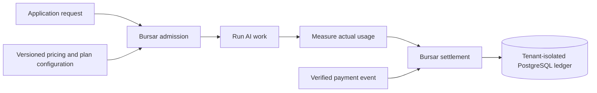

# Build a prepaid credit system for AI SaaS

An AI product usually knows whether a request may start before it knows the
request's final token, model, tool, or compute cost. A production credit system
must therefore do more than subtract a number from a balance: it must admit work
atomically, measure the result, survive retries, and leave an auditable history.

Bursar provides that boundary as an embedded, open-source Python and TypeScript
SDK backed by PostgreSQL.

## Outcome

This architecture gives an AI SaaS application:

- Prepaid, promotional, and subscription-funded credit lots
- Usage pricing based on tokens, models, tool calls, jobs, or compute measures
- Atomic enforcement of balance floors, quotas, entitlements, allowances, and concurrency
- Reservations for work whose final cost is not known at admission
- Idempotent charges, refunds, provider events, and job retries
- One tenant-isolated, append-only PostgreSQL ledger shared by Python and TypeScript services

## Put accounting behind one boundary

Keep identity and product workflows in the application. Route every operation
that changes financial state through one tenant-bound Bursar facade.

| Your application owns                       | Bursar owns                                                    |
| ------------------------------------------- | -------------------------------------------------------------- |
| Authentication and durable account identity | Credit accounts, lots, balances, and ledger entries            |
| AI request execution and usage measurement  | Pricing and atomic admission policy                            |
| Product user interface                      | Plans, allowances, entitlements, quotas, and spend caps        |
| Payment-provider catalog and tax            | Verified-event projection, subscriptions, top-ups, and refunds |

## Avoid balance-check-then-deduct

A separate `can afford` check followed by a debit is unsafe. Two concurrent
requests can both observe the same available balance and both begin work before
either debit commits. A process-local mutex only moves the race to another
worker and can also serialize unrelated tenants.

Use one of Bursar's transactional admission paths instead:

| Workload                                      | Admission path                        | Why                                                                             |
| --------------------------------------------- | ------------------------------------- | ------------------------------------------------------------------------------- |
| Final measurement is already known            | `deduct`                              | Prices, checks policy, and posts the charge atomically                          |
| Final cost is unknown or work is long-running | `reserve`, then `settle` or `release` | Holds worst-case capacity before work starts and charges actual usage afterward |
| A callback can own the complete lifecycle     | `run_billed` / `runBilled`            | Wraps reservation, work, settlement retries, and release-on-failure             |

The PostgreSQL transaction locks only the relevant tenant account while it
checks policy and posts accounting entries. It does not take one global ledger
lock for every tenant.

## Implementation path

1. **Install and migrate.** Install `bursar[postgres]` for Python or
   `@zonastery/bursar` plus `pg` for TypeScript. Apply the SQL baseline with a
   dedicated migration principal.
2. **Provision tenants.** Give every store an explicit tenant identifier and
   connect the application with a least-privilege runtime principal. Follow the
   [multi-tenancy guide](./multitenancy.mdx).
3. **Publish one configuration.** Define operations, measures, rate cards,
   plans, allowances, entitlements, quotas, credit buckets, and commerce offers
   in the [versioned configuration](../concepts/configuration.mdx).
4. **Create accounts from durable events.** Connect account creation and signup
   grants to an event that can be replayed safely.
5. **Map product usage to metrics.** Use stable operation names and explicit
   dimensions such as model or region. Keep monetary values as exact decimals.
6. **Choose atomic debit or reserve-settle.** Use `deduct` for known usage and a
   [lease](./financial-safety.mdx#leases-the-safe-path-for-long-running-ai-work)
   for uncertain usage.
7. **Connect payments only after verification.** Derive idempotency keys from
   verified provider event identifiers and pass normalized events through the
   [subscription and payment integration](./subscription-integration.mdx).
8. **Test retries and concurrency.** Replay successful requests, reuse a key
   with a changed payload, run simultaneous admissions, and verify that each
   tenant remains isolated.

## Preserve the accounting invariants

Treat these as release-blocking requirements:

- The account balance equals the sum of its relevant ledger entries.
- Every replayable monetary mutation has a stable idempotency key.
- The same key cannot represent two different requests.
- A strict-prepaid account never crosses its configured minimum balance.
- A lease can settle at most once and is released when work fails.
- Refunds reference and cannot exceed the original charge.
- Tenant context is transaction-local on shared database pools.
- Application code never updates Bursar-owned balances or ledger rows directly.

See [Protect financial invariants](./financial-safety.mdx) for executable Python
and TypeScript examples, and [Manage the credit lifecycle](./credit-lifecycle.mdx)
for signup grants, purchases, measured usage, refunds, expiry, and revocation.
