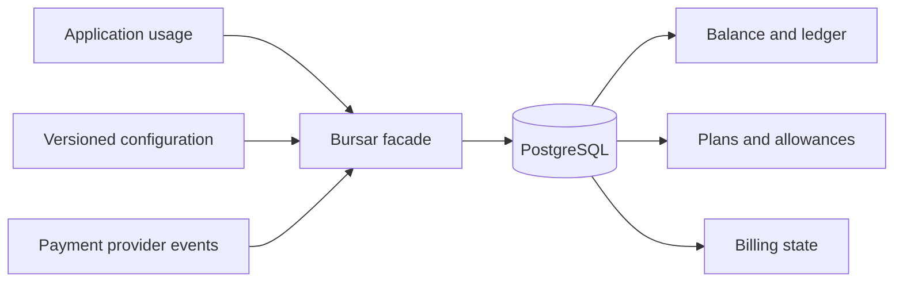

# What Bursar manages

Bursar is an open-source usage metering, credit ledger, and billing library for AI products. It prices operations, enforces account policy, and records each monetary change in PostgreSQL through matching Python and TypeScript software development kits (SDKs).

## The boundary Bursar owns

AI products need to decide whether work may start before they know its final cost. Bursar puts pricing, admission, and accounting behind one application boundary so those decisions use the same state.

Your application calls one `Bursar` facade. The facade exposes these capabilities:

| Capability | Responsibility                                                                    |
| ---------- | --------------------------------------------------------------------------------- |
| `credits`  | Balances, ledger entries, metered charges, leases, refunds, quotas, and analytics |
| `catalog`  | Validation, publication, activation, and rollback of configuration versions       |
| `accounts` | Default plan assignment and account-created grant programs                        |
| `billing`  | Normalized provider events, subscriptions, invoices, payments, and disputes       |
| `commerce` | Checkout, plan changes, top-ups, and auto-recharge                                |

`billing` and `commerce` are optional. Configure them only when Bursar should coordinate a payment provider.

## The guarantees Bursar enforces

Bursar concentrates the rules that are difficult to maintain across application handlers and background workers:

- **Exact money**: decimal values use fixed precision and half-up rounding. Configuration stores exact values as strings
- **Append-only accounting**: grants, purchases, charges, refunds, expiry, and revocation create ledger entries instead of rewriting history
- **Replay-safe writes**: stable idempotency keys prevent retries and webhook redelivery from posting a second mutation
- **Atomic admission**: plans, entitlements, quotas, allowances, balance floors, and lease capacity are checked in the transaction that admits work
- **Tenant isolation**: mandatory tenant identifiers, composite foreign keys, and forced row-level security keep tenant data separate
- **Cross-SDK parity**: Python and TypeScript share configuration fixtures, SQL migrations, expression cases, error categories, and rounding behavior

Read [Financial safety](./guides/financial-safety.mdx) before integrating any path that moves money or admits long-running work.

## What remains outside Bursar

Bursar does not replace your product database, identity provider, tax system, general ledger, or payment processor. Your application still owns account identity, product workflows, and the user interface. Bursar owns the metered-credit boundary and can project payment-provider events into that boundary.

Use Bursar when your product needs one or more of these controls:

- Prepaid balances or promotional credit grants
- Per-operation pricing based on token, model, job, or compute measures
- Plans with allowances, entitlements, quotas, and spend caps
- Reservations for work whose final cost is unknown at admission
- Replay-safe subscription, top-up, refund, and auto-recharge workflows
- An auditable account ledger shared across Python and TypeScript services

## Supported platforms

| Surface                               | Supported version      | Package                                   |
| ------------------------------------- | ---------------------- | ----------------------------------------- |
| Python SDK and command-line interface | Python 3.12 and 3.13   | `bursar`                                  |
| TypeScript SDK                        | Node.js 22 or newer    | `@zonastery/bursar`                       |
| Database                              | PostgreSQL 16 or newer | `pg_partman` 5.x and `pg_jsonschema` 0.3+ |

The current documentation tracks Bursar 2.x. Docusaurus version snapshots will be added only when a future major release changes user-facing behavior.

## Choose the next document

- Follow [Create your first metered charge](./quickstart.mdx) to install the schema and post one usage charge
- Run the [executable tutorials](/docs/tutorials) to learn each workflow against an isolated PostgreSQL environment
- Follow the [concept reading path](./concepts/index.mdx) to understand the architecture, credit accounting, pricing, access, and billing models
- Open the [Python API](./python-api/index.mdx) or [TypeScript API](./javascript-api/index.mdx) for exact call signatures
