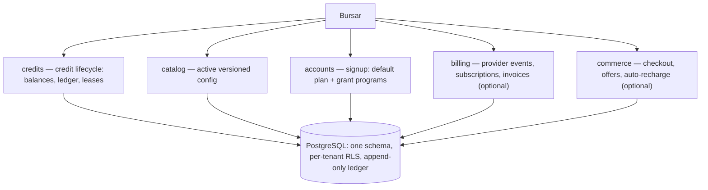

# Introduction

Bursar is a reusable credit ledger and billing engine for AI SaaS. It gives
your application one place to meter usage, sell prepaid credits, run plans and
allowances, and orchestrate subscriptions — over a single PostgreSQL schema,
from identical Python and JavaScript SDKs.

## The problem

AI costs are per-token and unpredictable. A completion's price depends on the
model, input length, output length, and cache behavior, and the invoice lands
long after the request. Naive approaches fail in familiar ways:

- **Balances in Redis** drift under concurrency and lose history.
- **Billing providers** know your prices but not your product — they cannot
  meter `input_tokens` against a rate card, enforce a free plan's monthly
  allowance, or gate a paid feature.
- **Hand-rolled ledger code** is where float rounding, double spends, and
  unreconcilable balances live.

Bursar pushes metering, pricing, and money state into one system of record.

## What you get

- **One canonical config.** A single strict, versioned document drives pricing
  operations and rate cards, credit buckets, entitlements, plans, quotas,
  offers, and auto-recharge guardrails. The same document bills identically
  in Python and JavaScript.
- **An exact, append-only ledger.** All money is exact decimal, stored as
  `numeric(20,6)` with half-up rounding. Every mutation appends a ledger entry
  with a `balance_after` invariant; there is no floating-point drift.
- **Atomic reserve/settle leases.** Long-running work reserves credits
  up front, then settles the actual cost or releases the hold. Entitlements,
  quotas, and concurrency limits are enforced atomically at admission.
- **Idempotent mutations.** Every write is replay-safe through a per-account
  idempotency key, so webhooks, retries, and worker redeliveries are no-ops.
- **Per-tenant isolation.** One schema serves every tenant; row-level security
  and composite foreign keys keep tenant data separate even under buggy code.
- **Two SDKs, one schema.** The Python and JavaScript SDKs share API shape
  (snake_case ↔ camelCase 1:1) and the same Postgres schema and config.

## How it fits together

Applications construct one `Bursar` facade and call its capabilities:

`billing` and `commerce` are present only when a `billing_store` (and, for
`commerce`, `commerce_options`) is supplied at construction.

## Language support

| SDK | Runtime | Install |
| --- | --- | --- |
| Python | Python 3.12+ | `pip install bursar[postgres]` |
| JavaScript | Node.js 22+ | `npm install @zonastery/bursar` |
| Database | PostgreSQL 16 | one `bursar` schema, one migration runner |

## Next

Start with the [Quickstart](./quickstart.mdx) — schema, first config, first
credits, and a first charge in about ten minutes. For the mental model first,
read [The data model](./concepts/data-model.mdx).
