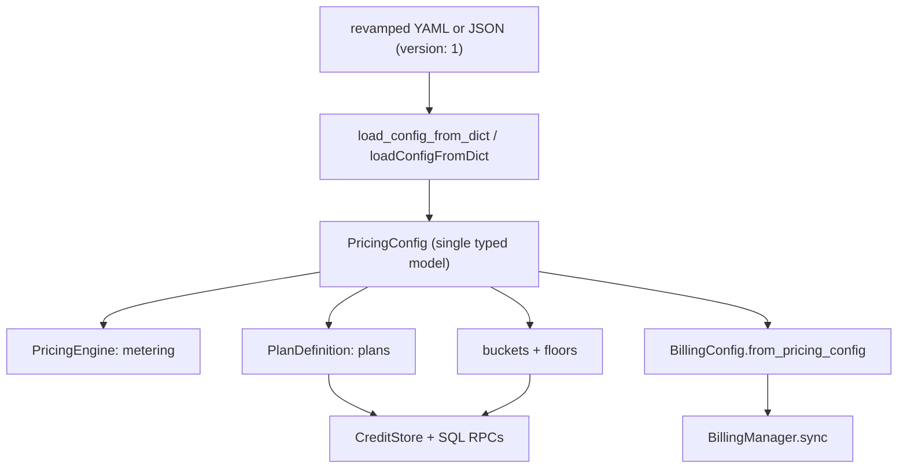

# Bursar Config Schema Revamp — Implementation Plan

Companion to [schema-revamp.md](schema-revamp.md). This is the concrete,
file-level build plan for both the Python and JavaScript SDKs, the shared
parity fixture, docs, and the notebook.

Locked scope: full propagation of renames through runtime + SQL + public API;
full merge of `features`/`feature_limits` into `entitlements`; `*` replaces
`_default`. **Keep `version: 1`** — redesign the config shape and codebase in
place; no version bump, no backward-compat shim (module unreleased).

---

## 1. Guiding approach

- The four config sections are an authoring reshape, but because we chose FULL
  propagation, the internal runtime models, SQL identifiers, and public result
  types are renamed too — the config is not merely translated at the boundary.
- One model per concept. Delete `PricingConfigData`; type the billing sections.
- Land Python fully green (Phases 1-3 + its tests) BEFORE porting to JS (Phase 4),
  so the shared parity fixture anchors the JS port.
- Keep money semantics identical: Decimal everywhere, `ROUND_HALF_UP` at 4dp,
  clamp total `>= 0` once, same result cross-SDK.

## 2. SQL / migration strategy

The module is unreleased, so:

- Rewrite the numbered migration files in place rather than adding rename
  migrations. `setup()` re-applies every file on every run and they are
  idempotent, so `CREATE TABLE IF NOT EXISTS public.credit_buckets (...)` with
  the new names is sufficient for fresh databases.
- No `ALTER TABLE ... RENAME` dance and no data migration is written. Existing
  dev/test databases MUST be recreated (`setup()` on a clean DB). Call this out
  in the PR description and docs.
- Physical identifiers change with the code: tables `credit_buckets` /
  `user_credit_buckets`, RPCs `sync_buckets_from_config` /
  `get_user_credit_buckets`, and tx metadata JSONB keys `bucket` /
  `bucket_breakdown`.

## 3. Data flow

---

## Phase 1 — Python external schema + model unification

Files:

- `python/src/bursar/config.py`
  - Replace flat `PricingConfig` with nested sub-models: `MeteringConfig`,
    `LedgerConfig`, `BillingSection`, plus `plans: dict[str, PlanDefinition]`.
  - `version: Literal[1] = 1` (unchanged integer; new nested shape only).
  - `model_config = ConfigDict(extra="forbid")` on every sub-model.
  - Move validators onto the sub-models: models non-empty; bucket single-default
    / single-overdraft / `ttl_days > 0` / non-empty map; plan label uniqueness;
    expression validation (global vars for models/search/cache_discount/rate_overrides,
    `calls` added only for tools); `flat_jobs` and `allowance.amount` `>= 0`;
    `billing.subscriptions.*.plan` referential check; discriminated `grant`.
  - `load_config_from_dict` unchanged signature; returns the new `PricingConfig`.
- `python/src/bursar/interface/models.py`
  - `BucketDefinition` (was `TierDefinition`): `label`, `priority`, `expires`,
    `ttl_days`, `default`, `allow_overdraft`.
  - `Entitlement` (new): `value: Any | None`, `max_calls: int | None`,
    `period`, `on_exceed`.
  - `PlanDefinition`: `label`, `allowance: Allowance`, `rate_overrides`,
    `safety: PlanSafety`, `entitlements: dict[str, Entitlement]`.
  - `Allowance` (`amount`, `period`) and `PlanSafety`
    (`billing_mode`, `max_concurrent`, `overdraft_floor`, `per_operation`).
  - `OperationPolicy` retained (now nested under `safety.per_operation`).
  - Result-type renames: `BucketBalance`, `BucketBalancesResult`
    (`buckets`, `bucket_key`), `DeductionResult.bucket_breakdown`,
    `RefundResult.bucket_breakdown`, `SweepResult.expired_by_bucket`,
    `GetUserPlanResult` (allowance/safety/entitlements shape).
  - Delete `PricingConfigData`. Update `PricingConfigResult.config` to
    `PricingConfig`. Remove the field-parity test's dual-model premise.
- `python/src/bursar/billing/models.py`
  - `ProviderRef` (unify `BillingProviderRefs` + `BillingSubscriptionOfferRef`);
    provider is the map key.
  - `BillingOffer`: drop `offer_key`; `plan`; nested `grant: SubscriptionGrant`
    (discriminated `AllowanceGrant` | `CycleGrant`).
  - `BillingCreditTopup`: `credits_per_unit`, `deposit_to`, drop per-topup `currency`.
  - `BillingConfig`: add `currency`; add `from_pricing_config(cfg: PricingConfig)`
    classmethod so callers stop hand-wrapping `BillingOffer(offer_key=k, **v)`.

## Phase 2 — Python engine + manager + billing runtime

- `python/src/bursar/engine.py`
  - `_calc_model` / `resolve_model` / `has_model`: `*` fallback (was `_default`).
  - `_calc_tools`: `*` fallback + `calls` variable (was `this_tool_calls`).
  - `_calc_cache`: read `metering.cache_discount`, subtract it (negate result).
  - `_calc_fixed` -> `_calc_flat_jobs`; `get_fixed_cost` -> `get_flat_job_cost`
    reading `metering.flat_jobs`.
  - `pricing_schema()` returns the single `PricingConfig`.
  - Access config via `self._config.metering.*`, `self._config.ledger.min_balance`.
- `python/src/bursar/metrics.py`: `fixed_job` -> `flat_job`; keep
  `METRIC_VARIABLES`; document `calls` as the tools-only variable.
- `python/src/bursar/manager.py`
  - Read `plan.safety.*` for policy resolution; `plan.allowance.{amount,period}`;
    `plan.entitlements` (split value vs limit at use sites for `check_feature`
    and feature-limit enforcement); `ledger.buckets`; `ledger.signup_grant`;
    `metering.flat_jobs`.
  - Rename any `tier`-named locals/args in the public surface to `bucket`.
- Billing runtime:
  - `python/src/bursar/billing/manager.py`: consume `ProviderRef`/`grant`;
    resolve offers by map key; auto-build `BillingConfig` from the pricing config.
  - `python/src/bursar/billing/store.py`, `memory.py`, `postgres.py`,
    `supabase.py`: offer/topup sync using new field names.

## Phase 3 — Python stores + SQL + CLI

- Stores: `python/src/bursar/interface/base.py`, `memory.py`, `postgres.py`,
  `supabase.py`
  - `get_bucket_balances` (was `get_tier_balances`); merged-entitlement reads;
    `get_user_plan` returns the new allowance/safety/entitlements shape;
    metadata key renames in grant/deduct/refund/sweep paths.
- SQL (rewrite in place):
  - `python/src/bursar/sql/004_plans.sql`: plan JSONB keys `label`, `allowance`,
    `safety`, `entitlements`; `sync_plans_from_config` reads new keys.
  - `python/src/bursar/sql/010_credit_tiers.sql`: rename to buckets tables/RPCs
    (`credit_buckets`, `user_credit_buckets`, `sync_buckets_from_config`,
    `get_user_credit_buckets`), config key `buckets`, metadata `bucket`.
  - `python/src/bursar/sql/012_feature_limits.sql`: count invocations from the
    merged entitlement metadata; `check_feature_limit` contract unchanged in
    behavior.
  - `python/src/bursar/sql/009_deduct_and_leases.sql`: metadata `bucket` /
    `bucket_breakdown`; deny-at-admission reads entitlement limits.
  - Consider `011_lazy_expiry.sql` references to tier metadata.
- `python/src/bursar/__main__.py`: `bursar config schema` emits the revamped
  JSON Schema (`version: 1`); `bursar config set` validates the new shape.
- `python/src/bursar/__init__.py`: update exports for renamed symbols
  (`BucketDefinition`, `ProviderRef`, etc.).

## Phase 4 — JavaScript mirror (parity)

- `javascript/src/config.ts`: rewrite `loadConfigFromDict` for the nested
  revamped layout, keep
  snake<->camel normalization for every new key, `*` fallback, `calls`,
  `cache_discount`, typed `billing.subscriptions`/`topups`, merged
  `entitlements`, discriminated `grant`, unified `ProviderRef`. Update
  `TOP_LEVEL_KEYS` and the per-section key sets.
- `javascript/src/types.ts`: `BucketDefinition`, new `PlanDefinition`,
  `Entitlement`, `PlanSafety`, `Allowance`, result-type renames
  (`BucketBalance(s)`, `bucketBreakdown`, `expiredByBucket`).
- `javascript/src/engine.ts`: `*`, `calls`, cache negation, `flatJobs`.
- `javascript/src/metrics.ts`: `flatJob`.
- `javascript/src/manager.ts`: consume `safety`/`allowance`/`entitlements`/`buckets`.
- `javascript/src/allowance.ts`: period handling (names unchanged).
- Billing: `javascript/src/billing/billing-types.ts` (drop `offerKey`, unify
  refs to `ProviderRef`, nest `grant`, `creditsPerUnit`, `depositTo`, config
  `currency`), `billing-manager.ts` + `memory-billing-store.ts` /
  `postgres-billing-store.ts` / `supabase-billing-store.ts`; wire billing config
  from the pricing config (closes the current gap where JS ignored these keys).
- Stores: `javascript/src/stores/memory-store.ts`, `postgres-store.ts`,
  `supabase-store.ts`, `credit-store.ts`, `events.ts`.
- Exports: `javascript/src/index.ts`, `javascript/src/node.ts`.
- `javascript/src/load-pricing-file.ts`: expected unchanged (raw parse only).

## Phase 5 — Shared parity fixture + tests

- `tests/parity/config_validation_cases.json`: rewrite all cases to the new
  nested shape (`version: 1`);
  add cases for `*` fallback, `calls` scoping, `cache_discount`, merged
  `entitlements`, discriminated `grant`, `billing.subscriptions.plan`
  reference check, unified `providers`. Both runners keep loading this file
  directly:
  - `python/tests/test_config_parity.py`
  - `javascript/tests/config-parity.test.ts`
- Python tests to update: `test_config.py`, `test_tiers.py`, `test_manager.py`,
  `test_store.py`, `test_store_integration.py`, `test_pricing_cache.py`,
  `test_cli.py`, `test_engine.py`, `test_invariants_property.py` (metadata keys),
  `test_security_rls.py` (RPC names).
- JS tests to update: `config.test.ts`, `tiers.test.ts`,
  `credit-manager.test.ts`, `engine.test.ts`, `pricing-cache.test.ts`,
  `memory-store.test.ts`, `store-integration.test.ts`,
  `load-pricing-file.test.ts`, `invariants.property.test.ts`.

## Phase 6 — Docs, samples, notebook

- `docs/docs/configuration.mdx`: full rewrite (four sections, YAML+JSON, `version: 1`).
- `docs/docs/expressions.mdx`: `calls` (not `this_tool_calls`); `cache_discount`
  positive-sign note.
- `docs/docs/subscription-integration.mdx`: `grant`, `providers`, `deposit_to`.
- `docs/docs/cli.mdx`, `docs/docs/python-api/pricing-engine.mdx`,
  `docs/docs/javascript-api/index.mdx`: updated snippets and schema output.
- `python/README.md`, `javascript/README.md`: config snippets.
- Locate and update sample `pricing.{yaml,json}` fixtures under `samples/` and
  any `docs/` example files.
- `samples/python/notebooks/15_pricing_config_schema.ipynb`: FULL rewrite to the
  revamped schema
  (acceptance artifact — every cell must run against the new schema, including
  the `BillingConfig.from_pricing_config` path replacing the manual rewrap).
- `samples/python/notebooks/12_cli_and_deployment.ipynb`: update if it prints or
  sets config.

## Phase 7 — Validation

- Python: `ruff check python/src python/tests`; `pyright python/src`;
  `pytest python/tests` on a FRESH Postgres (recreate DB) to exercise the renamed
  bucket tables/RPCs and merged-entitlement paths.
- JS: `npm run typecheck`; `npm run lint`; `npm test` (testcontainers Postgres).
- Cross-SDK: parity fixture green in both runners.
- Notebook: execute `15_pricing_config_schema.ipynb` top-to-bottom with no errors.

---

## Risks and sequencing

- Buckets rename is the largest, riskiest change: money-critical SQL, persisted
  tx metadata keys, and the public bucket API in both SDKs. Do it as its own
  reviewable commit within Phase 3, with the invariant/property tests as the guard.
- Entitlement merge changes the `check_feature_limit` RPC usage and
  `get_user_plan` shape across all six stores; keep the invariant tests'
  meaning unchanged.
- Cross-SDK drift: the parity fixture must be updated first and both runners kept
  green before broadening JS changes.
- Fresh-DB requirement must be communicated; there is no data migration.

## Acceptance criteria

1. Single `PricingConfig` model in Python; no `PricingConfigData`.
2. `subscriptions`/`topups` fully typed; no `dict[str, dict]`; no
   `BillingOffer(offer_key=...)` hand-wrapping anywhere.
3. No identifier duplicated as both dict key and inner field.
4. `cache_discount` positive; engine subtracts; total clamped `>= 0`.
5. `*` fallback and `calls` work in both SDKs; `_default`/`this_tool_calls` gone.
6. Shared parity fixture green in Python and JS.
7. Full test suites + notebook 15 green on a fresh database.
